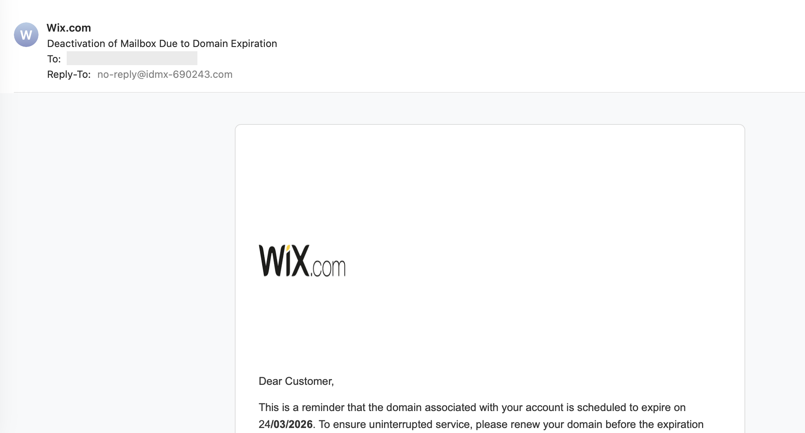
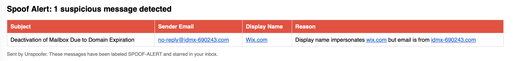

# Unspoofer Examples

## Incoming Threat

A phishing email impersonating Wix.com, sent from a innocuous looking domain:

## Spoof Alert Email

However, Unspoofer analyzes discrepancies between display name (Wix.com) and the real sender email (idmx-** ***.com) to identify a suspicious message.
It then sends an alert like this:

**Spoof Alert: 1 suspicious message detected**

| Subject | Sender Email | Display Name | Reason |
|---------|-------------|--------------|--------|
| Deactivation of Mailbox Due to Domain Expiration | no-reply@idmx-690243.com | Wix.com | Display name impersonates wix.com but email is from idmx-690243.com |

*Sent by Unspoofer. These messages have been labeled SPOOF-ALERT and starred in your inbox.*
